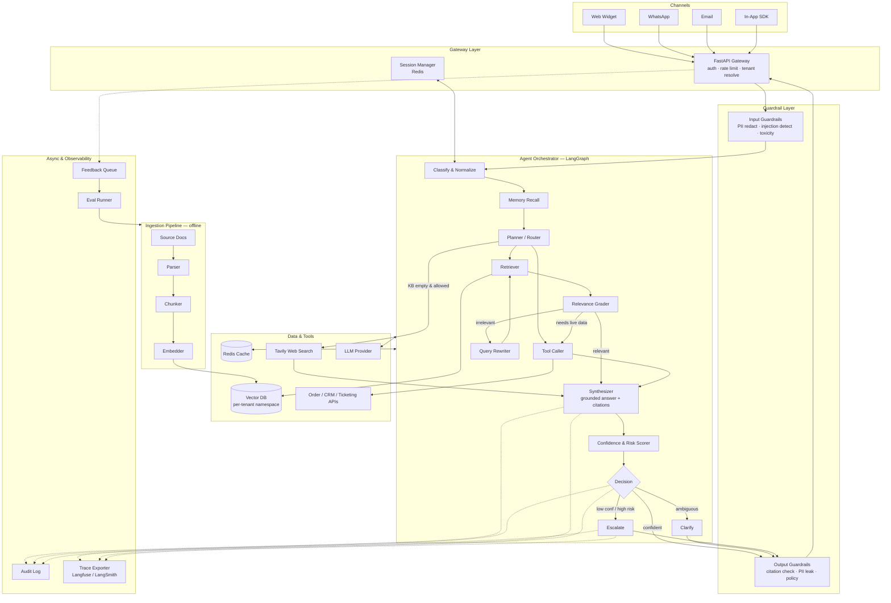

# Support Copilot

A white-label, agentic RAG copilot for customer support teams. Point it at a client's
docs, wire up their order/CRM/ticketing APIs, and it answers real customer questions
with citations — or hands off to a human when it shouldn't guess.

I built this as a reusable template rather than a one-off bot. Onboarding a new client
means adding a YAML file, re-running ingestion, and swapping connectors — not forking
the codebase.

---

## What it does

- Answers questions **only** from the client's own knowledge base, with inline citations.
- Pulls **live data** (order status, subscription state, open tickets) when the question
  needs it, not just static docs.
- **Refuses to guess.** If retrieval comes up empty, it says so, asks a clarifying
  question, or escalates — it does not improvise policy.
- **Escalates intelligently** on low confidence, high-risk intents (refunds, legal,
  cancellations, safety), negative sentiment, or an explicit "get me a human".
- **Logs everything**: every retrieval, tool call, score, and routing decision is
  traceable for compliance and weekly QA.

---

## Why I built it this way

Most "RAG chatbots" I've seen in production are a single linear chain:
`embed → retrieve → stuff into prompt → generate`. That breaks the moment a support
workflow branches, which is *always*:

- "Is this in our docs?" → maybe
- "Do I need to look up this customer's order first?" → maybe
- "Is this customer angry enough that I should hand off now?" → maybe
- "The first retrieval was garbage — should I rewrite the query and try again?" → yes

Those are **states**, not prompt instructions. Hiding them inside a 2000-token system
prompt makes them untestable and unobservable. So the core is a **LangGraph state
machine** with explicit nodes and edges — each branch is a function I can unit test,
and each transition is a line in the trace.

The second thing I got wrong initially and fixed: **guardrails are a layer, not a
paragraph in the system prompt.** Input guardrails (PII redaction, injection detection)
and output guardrails (citation verification, PII leak check) wrap the whole graph, so
they can't be talked out of by clever user input.

---

## Architecture



### Request lifecycle, step by step

1. A channel posts to `POST /api/chat` with `tenant_id`, `session_id`, and the message.
2. The gateway resolves the tenant, enforces per-tenant rate limits, and loads
   `configs/clients/<tenant>.yaml`.
3. **Input guardrails** redact PII, scan for prompt injection, and detect language.
4. The **session manager** pulls conversation history from Redis.
5. **Classify & Normalize** tags intent (billing / technical / order / complaint /
   general), risk level, and sentiment.
6. **Memory Recall** injects relevant long-term facts about this customer (prior
   tickets, plan tier, past complaints).
7. **Planner** decides the path: retrieve-only, retrieve + tool, tool-only, or
   web-fallback.
8. **Retriever** and **Tool Caller** run in parallel where possible.
9. **Relevance Grader** scores the retrieved chunks. If they're weak, **Query Rewriter**
   reformulates and loops back (max 2 attempts, then it gives up honestly).
10. **Synthesizer** writes the answer strictly from retrieved + tool context, with
    inline citations.
11. **Confidence & Risk Scorer** assigns a numeric confidence and a risk flag —
    deliberately separate from generation so it can be calibrated and tuned.
12. **Decision** routes to respond, clarify, or escalate.
13. **Output guardrails** verify every claim maps to a citation and no PII leaked.
14. The response streams back to the channel. Audit + trace writes happen async so
    they never block the user.
15. Thumbs up/down flows into the feedback queue, which feeds the eval set.

### Why a graph, not a chain

| Need | Linear chain | Graph |
|---|---|---|
| Rewrite query when retrieval is weak | ❌ | ✅ loop back to retrieve |
| Branch to live tool calls mid-flow | hacky | ✅ explicit node |
| Score before deciding to escalate | ❌ | ✅ separate node |
| Unit-test each decision point | ❌ | ✅ one test per node |
| Explain *why* it answered that way | ❌ | ✅ trace shows the path |

---

## Key design decisions

| Decision | Choice | Rationale |
|---|---|---|
| Orchestration | LangGraph | Explicit state machine; branches are testable, not prompt-embedded |
| API | FastAPI | Async, streaming-friendly, trivial to containerize |
| LLM | Swappable via config | GPT-4o / 4o-mini, Claude, or Groq-Llama depending on client budget |
| Vector DB | Pinecone (managed) or Chroma/Qdrant (self-host) | Pinecone for scale; Chroma for a cheap pilot |
| Tenancy | One index, namespace per client | Serve many clients from one deployment |
| Cache | Redis | Sessions, retrieval results, and hot FAQ answers |
| Confidence scoring | Separate node, not prompt output | Lets me calibrate thresholds without touching the generator |
| Guardrails | Layered, outside the graph | Can't be prompt-injected away |
| Observability | Langfuse / LangSmith + structured logs | Non-negotiable for support use cases |
| Deployment | Docker + compose → any cloud | Portable across client infra |

---

## Repository layout

```
support-copilot/
├── app/
│   ├── api/
│   │   ├── routes.py            # /chat /feedback /health /admin/ingest
│   │   └── deps.py              # auth, tenant resolution, rate limiting
│   ├── core/
│   │   ├── config.py            # env + per-client YAML loader
│   │   ├── logging.py           # structured logs + audit trail
│   │   └── guardrails.py        # input + output guardrails
│   ├── rag/
│   │   ├── state.py             # LangGraph state schema
│   │   ├── vectorstore.py       # embeddings + vector DB client
│   │   ├── workflow.py          # graph definition (nodes + edges)
│   │   └── nodes/
│   │       ├── classify.py
│   │       ├── memory.py
│   │       ├── retrieve.py
│   │       ├── grade.py
│   │       ├── rewrite.py
│   │       ├── tools.py
│   │       ├── web_fallback.py
│   │       ├── synthesize.py
│   │       ├── score.py
│   │       └── escalate.py
│   ├── services/
│   │   ├── ingestion.py         # parse → chunk → embed → upsert
│   │   ├── memory.py            # session + long-term memory
│   │   ├── audit.py
│   │   ├── ticketing.py         # Zendesk / Freshdesk / Salesforce
│   │   └── cache.py
│   └── main.py
├── configs/
│   └── clients/
│       └── acme.yaml            # branding, tone, escalation rules, denylist
├── data/
│   └── sample_kb/               # drop client docs here
├── static/                      # widget css/js
├── templates/
│   └── index.html
├── tests/
│   ├── test_nodes.py
│   ├── test_graph.py
│   └── eval/
│       └── gold_set.jsonl
├── ingest_kb.py
├── Dockerfile
├── docker-compose.yml
├── requirements.txt
└── run.py
```

---

## Getting started

```bash
git clone <your-repo> support-copilot
cd support-copilot
python -m venv .venv
.venv\Scripts\activate          # Windows
# source .venv/bin/activate     # macOS / Linux
pip install -r requirements.txt
cp .env.example .env
```

Fill in `.env`:

```env
LLM_PROVIDER=openai
OPENAI_API_KEY=sk-...
VECTOR_DB=chroma                 # chroma for local, pinecone for prod
PINECONE_API_KEY=
PINECONE_INDEX_NAME=acme-support-kb
REDIS_URL=redis://localhost:6379
TAVILY_API_KEY=                  # optional — web fallback
TICKETING_PROVIDER=zendesk
ZENDESK_API_KEY=
ADMIN_API_KEY=change-me
```

Ingest a knowledge base:

```bash
python ingest_kb.py --client acme --source data/sample_kb/
```

Run it:

```bash
python run.py
# or
docker compose up -d
```

---

## Multi-tenancy

The whole point of the template is that onboarding a client is config, not code.

- **Vector data** lives in a namespace named after the tenant. One index, many tenants.
- **Behavior** lives in `configs/clients/<tenant>.yaml`:

```yaml
branding:
  name: "Acme Support"
  avatar: "/static/avatars/acme.png"
  primary_color: "#0b5fff"
  tone: "friendly-professional"

retrieval:
  top_k: 6
  min_relevance_score: 0.72
  max_rewrite_attempts: 2

escalation:
  confidence_threshold: 0.62
  always_escalate_intents:
    - refund_request
    - legal
    - account_cancellation
    - safety_complaint
  sentiment_threshold: -0.6
  destination: "zendesk:acme-tier2"

tools:
  order_status:
    enabled: true
    endpoint: "https://api.acme.com/orders/{order_id}"
  crm_lookup:
    enabled: true

web_search:
  enabled: false                 # off unless the client explicitly opts in
```

- **Quotas** are enforced per tenant at the gateway so one client can't starve another.

---

## Guardrails & safety

**Input side**
- PII redaction (cards, SSNs, passwords, auth tokens) before anything is logged.
- Prompt-injection scan — retrieved docs and web results are treated as **data**,
  never as instructions.
- Toxicity / abuse detection with an immediate escalate path.

**Output side**
- Citation verification: every factual claim must map to a retrieved chunk.
- PII leak check on the final answer.
- Policy denylist: the bot will not state pricing, legal terms, or refund amounts
  that aren't verbatim from the KB.

**Operational**
- Per-tenant API keys and rate limits.
- Audit log stores redacted conversations + full retrieval trace.
- Hard kill-switch endpoint per tenant.

---

## Evaluation

A demo is not evidence. Before go-live I build a gold set of 50–100 real questions
pulled from the client's actual ticket history, each with the expected answer and the
expected source document.

Metrics I track:

| Metric | What it catches |
|---|---|
| Retrieval precision@k | Right chunk actually surfaced? |
| Answer faithfulness | Hallucinated claims |
| Citation accuracy | Points to the right source? |
| Escalation precision / recall | Hands off when it should — and doesn't when it shouldn't |
| Deflection rate | % resolved without a human — the client's ROI number |

The eval runner is wired into the feedback loop: every thumbs-down and every escalated
conversation gets reviewed weekly and, if it reveals a KB gap, becomes a new test case
after the docs are fixed.

---

## Observability

- **Traces** via Langfuse/LangSmith — I can replay any conversation and see the exact
  retrieval scores, grader decision, rewrite attempt, and routing path.
- **Structured logs** (JSON) with tenant, session, latency, token cost, and decision
  outcome per turn.
- **Dashboards**: deflection rate, escalation rate, average confidence, cost per
  resolved conversation.

---

## Deployment

```bash
docker build -t support-copilot .
docker compose up -d
```

Then either:
- embed the widget: `<script src="https://yourdomain.com/widget.js" data-client="acme"></script>`
- or point the client's own frontend at `POST /api/chat`.

Start with one tenant namespace. The second client is where the template pays off —
one YAML file, one ingestion run, zero code changes.

---

## What changes per client

| Item | Where |
|---|---|
| Branding, tone, avatar, colors | `configs/clients/<client>.yaml` + widget CSS |
| Knowledge base | `data/<client>/` → re-run `ingest_kb.py` |
| Live system connectors | `app/services/` (swap Zendesk for Freshdesk, custom order API, etc.) |
| Escalation rules & blocked intents | `configs/clients/<client>.yaml` |
| Web fallback on/off | `.env` + client YAML |
| LLM provider / model | `.env` |

---

## Roadmap

- [ ] Streaming token output end-to-end in the widget
- [ ] Voice channel via a telephony bridge
- [ ] Automatic KB gap detection from escalated conversations
- [ ] A/B harness for prompt and model changes against the gold set
- [ ] Fine-grained per-tenant cost budgets with auto-downgrade to a cheaper model

---

## Known limitations (I tell clients these up front)

- **Quality is capped by their docs.** Contradictory or stale knowledge bases need
  cleanup before the bot looks good. I budget for this in discovery.
- **Integrations are the real work.** The RAG part is maybe 30% of a production
  deployment; wiring order/CRM/ticketing APIs is the other 70%.
- **It is not a replacement for humans** on regulated or high-emotion interactions.
  Refunds, safety complaints, and legal issues escalate by design.
- **It needs a real eval set before go-live.** A demo is not a deployment.

---

## License

MIT — use it, white-label it, ship it.