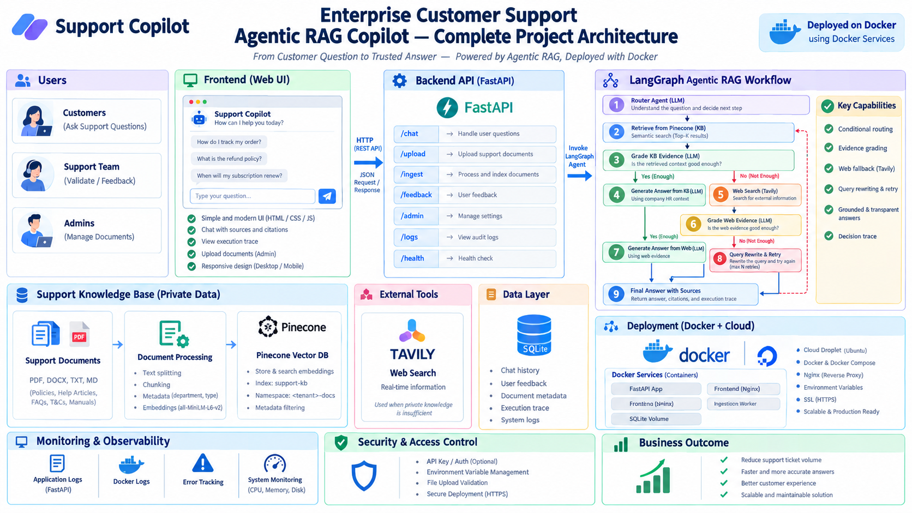

<div align="center">

# 🛟 Support Copilot

**A white-label, agentic RAG copilot for customer support teams.**

Point it at a client's docs, wire up their order/CRM/ticketing APIs, and it answers real
customer questions with citations — or hands off to a human when it shouldn't guess.

[](https://www.python.org/)
[](https://fastapi.tiangolo.com/)
[](https://langchain-ai.github.io/langgraph/)
[](https://www.docker.com/)
[](#license)

</div>

---

Built as a **reusable template**, not a one-off bot. Onboarding a new client means adding a
YAML file, re-running ingestion, and swapping connectors — not forking the codebase.

<br>

## 📐 Architecture

<div align="center">
  
</div>

<br>

> [!NOTE]
> The poster above is the whole system in one view: channels → gateway → guardrails →
> LangGraph orchestrator → data/tools, with the offline ingestion pipeline feeding the
> vector store. The step-by-step walkthrough is [below](#-request-lifecycle).

<br>

## 📑 Table of Contents

| | |
|---|---|
| [What it does](#-what-it-does) | [Multi-tenancy](#-multi-tenancy) |
| [Why I built it this way](#-why-i-built-it-this-way) | [Guardrails & safety](#-guardrails--safety) |
| [Request lifecycle](#-request-lifecycle) | [Evaluation](#-evaluation) |
| [Why a graph, not a chain](#-why-a-graph-not-a-chain) | [Observability](#-observability) |
| [Tech stack](#-tech-stack) | [Deployment](#-deployment) |
| [Key design decisions](#-key-design-decisions) | [What changes per client](#-what-changes-per-client) |
| [Repository layout](#-repository-layout) | [API reference](#-api-reference) |
| [Getting started](#-getting-started) | [Status · Roadmap · Limitations](#-project-status) |

<br>

## ✨ What it does

| | |
|---|---|
| 📚 **Grounded answers** | Responds **only** from the client's own knowledge base, with inline citations. |
| 🔌 **Live data** | Pulls order status, subscription state, and open tickets when the question needs it — not just static docs. |
| 🚫 **Refuses to guess** | If retrieval comes up empty it says so, asks a clarifying question, or escalates. It does not improvise policy. |
| 🙋 **Escalates intelligently** | On low confidence, high-risk intents (refunds, legal, cancellations, safety), negative sentiment, or an explicit *"get me a human"*. |
| 🔍 **Logs everything** | Every retrieval, tool call, score, and routing decision is traceable for compliance and weekly QA. |

<br>

## 🧠 Why I built it this way

Most "RAG chatbots" I've seen in production are a single linear chain:

```text
embed → retrieve → stuff into prompt → generate
```

That breaks the moment a support workflow branches, which is *always*:

- *"Is this in our docs?"* → maybe
- *"Do I need to look up this customer's order first?"* → maybe
- *"Is this customer angry enough that I should hand off now?"* → maybe
- *"The first retrieval was garbage — should I rewrite the query and try again?"* → yes

Those are **states**, not prompt instructions. Hiding them inside a 2000-token system prompt
makes them untestable and unobservable. So the core is a **LangGraph state machine** with
explicit nodes and edges — each branch is a function I can unit test, and each transition is
a line in the trace.

The second thing I got wrong initially and fixed: **guardrails are a layer, not a paragraph
in the system prompt.** Input guardrails (PII redaction, injection detection) and output
guardrails (citation verification, PII leak check) wrap the whole graph, so they can't be
talked out of by clever user input.

<br>

## 🔄 Request lifecycle

<table>
<tr><th width="60">#</th><th>Stage</th><th>What happens</th></tr>
<tr><td align="center">1</td><td>Inbound</td><td>A channel posts to <code>POST /api/chat</code> with <code>tenant_id</code>, <code>session_id</code>, and the message.</td></tr>
<tr><td align="center">2</td><td>Gateway</td><td>Resolves the tenant, enforces per-tenant rate limits, loads <code>configs/clients/&lt;tenant&gt;.yaml</code>.</td></tr>
<tr><td align="center">3</td><td>Input guardrails</td><td>Redact PII, scan for prompt injection, detect language.</td></tr>
<tr><td align="center">4</td><td>Session manager</td><td>Pulls conversation history from Redis (falls back to in-memory if Redis isn't configured).</td></tr>
<tr><td align="center">5</td><td>Classify &amp; normalize</td><td>Tags intent (billing / technical / order / complaint / general), risk level, and sentiment.</td></tr>
<tr><td align="center">6</td><td>Memory recall</td><td>Injects relevant long-term facts about this customer — prior tickets, plan tier, past complaints.</td></tr>
<tr><td align="center">7</td><td>Planner</td><td>Picks the path: retrieve-only, retrieve + tool, tool-only, or web-fallback.</td></tr>
<tr><td align="center">8</td><td>Retrieve + tools</td><td>Vector search and live API calls run in parallel where possible.</td></tr>
<tr><td align="center">9</td><td>Relevance grader</td><td>Scores retrieved chunks. If weak, the query rewriter reformulates and loops back (max 2 attempts, then it gives up honestly).</td></tr>
<tr><td align="center">10</td><td>Synthesizer</td><td>Writes the answer strictly from retrieved + tool context, with inline citations.</td></tr>
<tr><td align="center">11</td><td>Confidence &amp; risk</td><td>Assigns a numeric confidence and a risk flag — deliberately separate from generation so it can be calibrated.</td></tr>
<tr><td align="center">12</td><td>Decision</td><td>Routes to respond, clarify, or escalate.</td></tr>
<tr><td align="center">13</td><td>Output guardrails</td><td>Verify every claim maps to a citation and that no PII leaked.</td></tr>
<tr><td align="center">14</td><td>Respond</td><td>Streams back to the channel. Audit + trace writes happen async so they never block the user.</td></tr>
<tr><td align="center">15</td><td>Feedback</td><td>Thumbs up/down flows into the feedback queue, which feeds the eval set.</td></tr>
</table>

<br>

## 🕸️ Why a graph, not a chain

| Need | Linear chain | Graph |
|---|:---:|:---|
| Rewrite query when retrieval is weak | ❌ | ✅ loop back to retrieve |
| Branch to live tool calls mid-flow | ⚠️ hacky | ✅ explicit node |
| Score before deciding to escalate | ❌ | ✅ separate node |
| Unit-test each decision point | ❌ | ✅ one test per node |
| Explain *why* it answered that way | ❌ | ✅ trace shows the path |

<br>

## 🧰 Tech stack

| Layer | Choice | Why |
|---|---|---|
| **Orchestration** | LangGraph | Explicit state machine; branches are testable, not prompt-embedded |
| **API** | FastAPI | Async, streaming-friendly, trivial to containerize |
| **LLM** | GPT-4o / 4o-mini, Claude, or Groq-Llama | Swappable via config — pick per client budget |
| **Vector DB** | Chroma (dev) · Pinecone (prod) | Chroma for a cheap pilot; Pinecone for scale |
| **Web fallback** | Tavily | Purpose-built for LLM agents, cited results |
| **Live systems** | REST connectors (Zendesk, Freshdesk, Salesforce, custom) | Support bots need real account data, not just static docs |
| **Frontend** | Embeddable HTML/CSS/JS widget, or React | Easiest thing to drop onto any client website |
| **Cache / sessions** | Redis (optional), in-memory fallback | Sessions, retrieval results, hot FAQ answers |
| **Auth** | Per-tenant header (`X-Tenant-Id`) + admin key | Enough for multi-tenant support |
| **Observability** | Structured JSON logs + audit trail | Need to see *why* the bot answered the way it did |
| **Deployment** | Docker + docker-compose → any cloud | Container-first, portable across client infra |

<br>

## 🎯 Key design decisions

| Decision | Choice | Rationale |
|---|---|---|
| Tenancy | One collection, filtered by `tenant_id` metadata | Serve many clients from one deployment |
| Confidence scoring | Separate node, not prompt output | Calibrate thresholds without touching the generator |
| Guardrails | Layered, outside the graph | Can't be prompt-injected away |
| Retrieval retry | Grader → rewriter → retry, capped at 2 | Recovers from bad queries without infinite loops |
| Observability | Structured JSON logs + audit JSONL | Non-negotiable for support use cases |
| Client config | YAML per tenant, no code changes | Onboarding is configuration, not a fork |

<br>

## 📁 Repository layout

```text
support-copilot/
├── app/
│   ├── main.py                  # FastAPI app factory + template mount
│   ├── api/
│   │   ├── routes.py            # /chat /feedback /health /admin/ingest
│   │   └── deps.py              # auth, tenant resolution, admin key
│   ├── core/
│   │   ├── config.py            # env + per-client YAML loader
│   │   ├── logging.py           # structured JSON logs
│   │   └── guardrails.py        # input + output guardrails
│   ├── rag/
│   │   ├── state.py             # LangGraph state schema
│   │   ├── vectorstore.py       # embeddings + Chroma client
│   │   ├── workflow.py          # graph definition (nodes + edges)
│   │   └── nodes/
│   │       ├── classify.py      # intent / risk / sentiment
│   │       ├── memory.py        # short-term history recall
│   │       ├── retrieve.py      # vector search
│   │       ├── grade.py         # relevance grading
│   │       ├── rewrite.py       # query rewriter
│   │       ├── tools.py         # order / CRM lookup        (stubbed)
│   │       ├── web_fallback.py  # Tavily web search
│   │       ├── synthesize.py    # grounded answer + citations
│   │       ├── score.py         # confidence & risk scoring
│   │       └── escalate.py      # human handoff + ticket
│   └── services/
│       ├── ingestion.py         # parse → chunk → embed → upsert
│       ├── cache.py             # session store (Redis or in-memory)
│       ├── audit.py             # conversation + feedback logging
│       └── ticketing.py         # Zendesk / Freshdesk / local (stubbed)
├── configs/clients/acme.yaml    # branding, tone, escalation rules
├── data/
│   ├── sample_kb/               # drop client docs here for ingestion
│   ├── chroma/                  # local vector store   (gitignored)
│   └── audit/                   # conversation logs    (gitignored)
├── static/widget.css            # chat widget styles
├── templates/index.html         # chat widget demo page
├── tests/
│   ├── test_nodes.py
│   ├── test_graph.py
│   └── eval/gold_set.jsonl
├── architecture.png             # architecture poster (embedded above)
├── ingest_kb.py                 # CLI ingestion entrypoint
├── run.py                       # uvicorn dev server
├── Dockerfile
├── docker-compose.yml
├── requirements.txt
└── .env.example
```

<br>

## 🚀 Getting started

### Prerequisites

- Python **3.10+**
- An OpenAI API key (or compatible endpoint)
- *Optional:* Redis, Tavily key, Pinecone key — only for prod-grade features

<details>
<summary><b>1 · Clone and create a virtual environment</b></summary>

<br>

```bash
git clone <your-repo> support-copilot
cd support-copilot
```

**macOS / Linux**
```bash
python -m venv .venv
source .venv/bin/activate
```

**Windows (PowerShell)**
```powershell
python -m venv .venv
.venv\Scripts\Activate.ps1
```

**Windows (cmd)**
```cmd
python -m venv .venv
.venv\Scripts\activate.bat
```

> [!TIP]
> If PowerShell blocks activation:
> `Set-ExecutionPolicy -ExecutionPolicy RemoteSigned -Scope CurrentUser`

</details>

<details>
<summary><b>2 · Install dependencies</b></summary>

<br>

```bash
pip install -r requirements.txt
```

</details>

<details open>
<summary><b>3 · Configure environment</b></summary>

<br>

```bash
cp .env.example .env      # Windows: Copy-Item .env.example .env
```

```env
LLM_PROVIDER=openai
OPENAI_API_KEY=sk-...
OPENAI_MODEL=gpt-4o-mini
EMBEDDING_MODEL=text-embedding-3-small

VECTOR_DB=chroma
CHROMA_PATH=./data/chroma
PINECONE_API_KEY=
PINECONE_INDEX_NAME=

REDIS_URL=                # blank → in-memory sessions
TAVILY_API_KEY=           # optional → enables web fallback

TICKETING_PROVIDER=none   # none | zendesk | freshdesk
ZENDESK_API_KEY=

ADMIN_API_KEY=change-me
LOG_LEVEL=INFO
HOST=0.0.0.0
PORT=8000
```

</details>

<details open>
<summary><b>4 · Ingest a knowledge base and run</b></summary>

<br>

Drop client PDFs / DOCX / TXT / MD into `data/sample_kb/`, then:

```bash
python ingest_kb.py --client acme --source data/sample_kb/
```

This chunks documents, embeds them, and stores them tagged `tenant_id=acme`.

```bash
python run.py             # or: docker compose up -d
```

Open **http://localhost:8000** — the chat widget is wired to the `acme` tenant.

</details>

<details>
<summary><b>5 · Test the API directly</b></summary>

<br>

```bash
curl -X POST http://localhost:8000/api/chat \
  -H "Content-Type: application/json" \
  -H "X-Tenant-Id: acme" \
  -d '{"session_id":"test1","message":"What is your refund policy?"}'
```

</details>

<br>

## 🏢 Multi-tenancy

The whole point of the template is that onboarding a client is **config, not code**.

- **Vector data** lives in one collection, filtered by `tenant_id` metadata. One index, many tenants.
- **Quotas** are enforced per tenant at the gateway, so one client can't starve another.
- **Behavior** lives in `configs/clients/<tenant>.yaml`:

```yaml
branding:
  name: "Acme Support"
  avatar: "/static/avatars/acme.png"
  primary_color: "#0b5fff"
  tone: "friendly-professional"

retrieval:
  top_k: 6
  min_relevance_score: 0.72
  max_rewrite_attempts: 2

escalation:
  confidence_threshold: 0.62
  always_escalate_intents:
    - refund_request
    - legal
    - account_cancellation
    - safety_complaint
  sentiment_threshold: -0.6
  destination: "local:acme-tier2"

tools:
  order_status:
    enabled: true
    endpoint: "https://api.acme.example/orders/{order_id}"
  crm_lookup:
    enabled: true

web_search:
  enabled: false
```

<br>

## 🛡️ Guardrails & safety

<table>
<tr>
<td width="33%" valign="top">

**Input side**

- PII redaction (cards, SSNs, passwords, auth tokens) before anything is logged
- Prompt-injection scan — retrieved docs and web results are treated as **data**, never as instructions
- Toxicity / abuse detection with an immediate escalate path

</td>
<td width="33%" valign="top">

**Output side**

- Citation verification: every factual claim must map to a retrieved chunk
- PII leak check on the final answer
- Policy denylist: never states pricing, legal terms, or refund amounts that aren't verbatim from the KB

</td>
<td width="33%" valign="top">

**Operational**

- Per-tenant API keys and rate limits
- Audit log stores redacted conversations + full retrieval trace
- Hard kill-switch endpoint per tenant via `/api/admin`

</td>
</tr>
</table>

<br>

## 📊 Evaluation

> A demo is not evidence.

Before go-live I build a gold set of **50–100 real questions** pulled from the client's actual
ticket history, each with the expected answer and the expected source document.

| Metric | What it catches |
|---|---|
| Retrieval precision@k | Did the right chunk actually surface? |
| Answer faithfulness | Hallucinated claims |
| Citation accuracy | Does it point to the right source? |
| Escalation precision / recall | Hands off when it should — and doesn't when it shouldn't |
| **Deflection rate** | % resolved without a human — the client's ROI number |

The eval runner is wired into the feedback loop: every thumbs-down and every escalated
conversation gets reviewed weekly and, if it reveals a KB gap, becomes a new test case once
the docs are fixed.

<br>

## 🔭 Observability

- **Traces** — every result includes a `trace` array showing which nodes ran, which tools fired, what the grader decided, and why the final routing happened.
- **Structured logs** (JSON) with tenant, session, latency, and decision outcome per turn.
- **Audit log** at `data/audit/<tenant>.jsonl` — one redacted line per turn, easy to tail or ship to a warehouse.
- **Feedback log** at `data/feedback.jsonl` — every thumbs up/down with session and message ID.

```json
{
  "ts": "2026-09-17T10:42:11Z",
  "tenant_id": "acme",
  "session_id": "sess-abc123",
  "intent": "billing",
  "confidence": 0.78,
  "decision": "respond",
  "citations": [{ "index": 1, "source": "refund-policy.pdf", "score": 0.31 }],
  "flags": []
}
```

<br>

## 🐳 Deployment

```bash
docker build -t support-copilot .
docker compose up -d
```

The compose stack brings up:

| Service | Port | Role |
|---|---|---|
| `api` | 8000 | FastAPI app |
| `redis` | 6379 | Session cache |

Then either embed the widget:

```html
<script src="https://yourdomain.com/widget.js" data-client="acme"></script>
```

…or point the client's own frontend at `POST /api/chat` with header `X-Tenant-Id: acme`.

Works on Render, Fly.io, Railway, or a plain VM. Start with one tenant namespace — **the
second client is where the template pays off**: one YAML file, one ingestion run, zero code changes.

<br>

## 🔧 What changes per client

| Item | Where |
|---|---|
| Branding, tone, avatar, colors | `configs/clients/<client>.yaml` + widget CSS |
| Knowledge base | `data/<client>/` → re-run `ingest_kb.py` |
| Live system connectors | `app/rag/nodes/tools.py`, `app/services/ticketing.py` |
| Escalation rules & blocked intents | `configs/clients/<client>.yaml` |
| Web fallback on/off | `.env` + client YAML |
| LLM provider / model | `.env` |

<br>

## 🔌 API reference

All endpoints live under `/api`. Every request must include `X-Tenant-Id`.

<details open>
<summary><code><b>POST</b> /api/chat</code></summary>

<br>

**Request**
```json
{
  "session_id": "sess-abc123",
  "message": "What is your refund policy?",
  "channel": "web"
}
```

**Response**
```json
{
  "answer": "Refunds are processed within 5 business days [1]...",
  "citations": [
    { "index": 1, "source": "refund-policy.pdf", "type": "kb", "score": 0.31 }
  ],
  "confidence": 0.78,
  "decision": "respond",
  "trace": [
    { "node": "classify", "intent": "billing", "risk": "low", "sentiment": 0.2 },
    { "node": "retrieve", "num_results": 6, "top_score": 0.31 },
    { "node": "grade", "ok": true, "method": "heuristic" },
    { "node": "synthesize", "answer_len": 187, "num_citations": 1 },
    { "node": "score", "confidence": 0.78 }
  ]
}
```

</details>

<details>
<summary><code><b>POST</b> /api/feedback</code></summary>

<br>

```json
{
  "session_id": "sess-abc123",
  "message_id": "...",
  "rating": 1,
  "comment": "Perfect answer."
}
```

</details>

<details>
<summary><code><b>POST</b> /api/admin/ingest</code> — requires <code>X-Admin-Key</code></summary>

<br>

```json
{ "source_path": "data/sample_kb" }
```

</details>

<details>
<summary><code><b>GET</b> /api/health</code></summary>

<br>

```json
{ "status": "ok", "vector_db": "chroma", "llm_model": "gpt-4o-mini" }
```

</details>

<br>

## 📦 Project status

<table>
<tr>
<td width="50%" valign="top">

### ✅ Fully working

- FastAPI gateway, tenant resolution, guardrails
- Session cache (Redis or in-memory)
- Vector retrieval (Chroma, tenant-filtered)
- Full LangGraph orchestration with retry loop
- Confidence scoring + escalation routing
- Audit log + feedback loop
- Ingestion pipeline (PDF / TXT / MD / DOCX)
- Embeddable chat widget
- Docker + compose
- Unit tests for graph and nodes

</td>
<td width="50%" valign="top">

### 🚧 Stubbed — swap per client

- `nodes/tools.py` — `_lookup_order` / `_lookup_crm` return fake data. Replace with real HTTP calls.
- `services/ticketing.py` — Zendesk branch returns a fake ticket ID.
- `nodes/web_fallback.py` — works with `TAVILY_API_KEY` set, otherwise silently skipped.
- Long-term memory — `memory.py` uses session history only. Needs a customer profile store for cross-session facts.

</td>
</tr>
</table>

### 🗺️ Roadmap

- [ ] Streaming token output end-to-end in the widget (SSE)
- [ ] Long-term customer memory backed by SQLite or Redis
- [ ] Real Zendesk / Freshdesk / Salesforce connectors
- [ ] Voice channel via a telephony bridge
- [ ] Automatic KB gap detection from escalated conversations
- [ ] A/B harness for prompt and model changes against the gold set
- [ ] Per-tenant cost budgets with auto-downgrade to a cheaper model

### ⚠️ Known limitations (I tell clients these up front)

- **Quality is capped by their docs.** Contradictory or stale knowledge bases need cleanup before the bot looks good. I budget for this in discovery.
- **Integrations are the real work.** RAG is maybe 30% of a production deployment; wiring order/CRM/ticketing APIs is the other 70%.
- **Not a replacement for humans** on regulated or high-emotion interactions. Refunds, safety complaints, and legal issues escalate by design.
- **It needs a real eval set before go-live.** A demo is not a deployment.

<br>

## 📄 License

MIT — use it, white-label it, ship it.

---

<div align="center">
  <sub>Built with FastAPI · LangGraph · Chroma · Docker · a lot of coffee.</sub>
</div>
